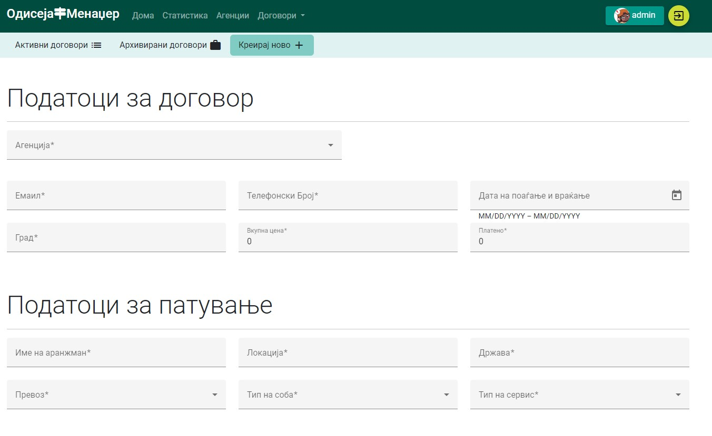
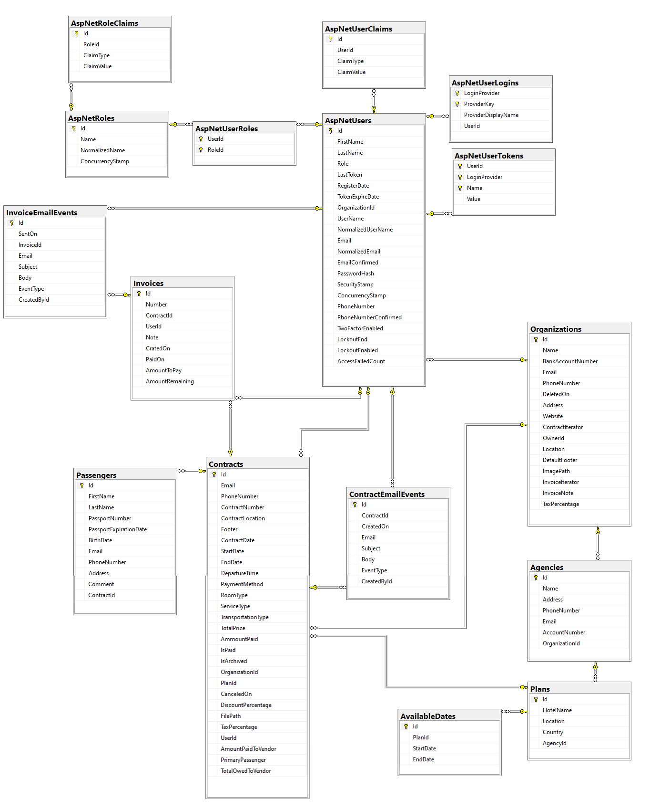

# Odyssey Manager 🌴⛱️🏝️🏖️
Odyssey Manager is an application to help travel agencies manage contracts, partners and passengers. Built using a C# RESTful API and Angular. The goal is to help travel agencies track past and ongoing trips with passengers, manage their contracts and partnering agencies.

  

## Features ⭐
- Restful API with ASP.NET Core (C#)
- Responsive UI with Angular and Angular material (Typescript)
- Entity Framework as an ORM using MSSQL for a database
- A repository pattern for data access
- JWT for user authentication

## Project structure ⚙️
The application follows an N-Tier architecture pattern to separate our codes responsibility.
- `domain` for the domain models as shown in the database diagram
- `data access` for CRUD operations also holds repositories
- `services` for business logic
- `api` for controllers
- `helpers` for helper functions in the api
- `DTOs` for data transfer objects to client
- `mappers` for mapping domain models to DTOs

### User interface
The user interface follows angular material standards and uses some bootstrap for simplicity.

`Example of the user interface`
- ui elements form both Angular material and bootstrap
- SVG ilustrations from [unDraw](https://undraw.co/illustrations)
- some images from [Unsplash](https://unsplash.com/)

### Database design
All domain models (subject to change)

`Database diagram`

## Configuration 🖥️
- setup connection string in `appsettings.json`
- `npm install` in frontend angular project
- run TravelAgency as default starting project
- run `ng serve` for client app
